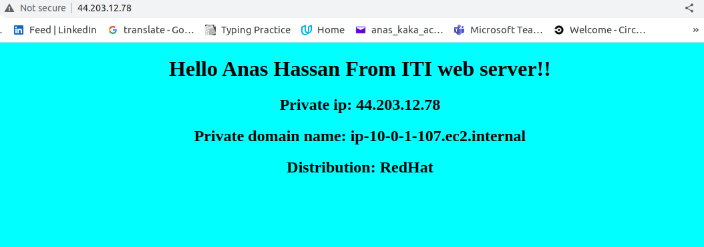
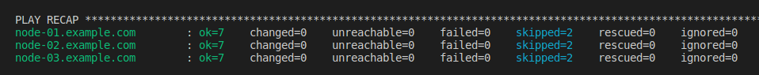

# Configure 3 different Ec2s (Amazon linux, ubuntu, RHEL)

## Aim

Using Ansible best practices such as:

1. Use roles instead of bulky playbook
2. Make sure than my playbook is idempotent
3. put handlers, Static files, Vars, host_vars, defaults variables in separate files

### Screenshots

1. The three different machines

- 
- 
- 

2. idempotency

- 
